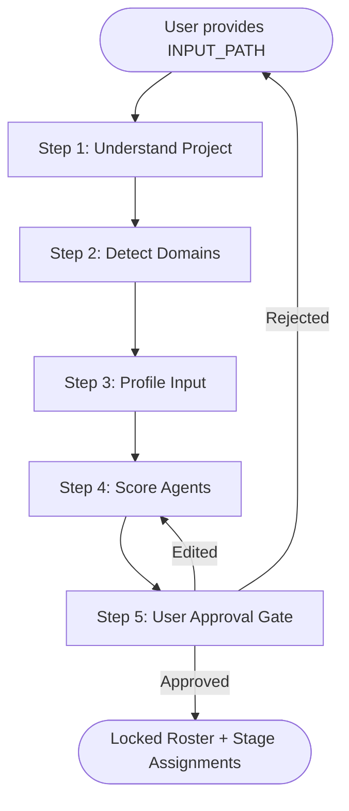
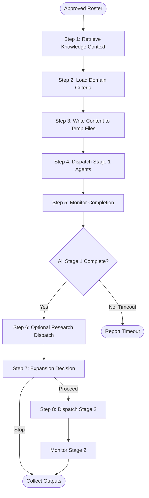
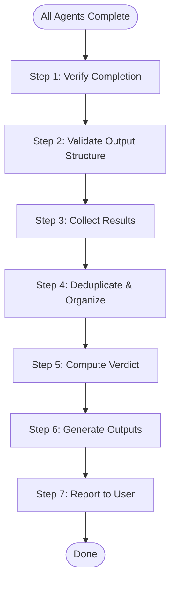

# flux-drive Protocol Lifecycle

> flux-drive-spec 1.0 | Conformance: Core

## Overview

flux-drive is a three-phase multi-agent review protocol: **Triage** (static analysis, scoring, user approval), **Launch** (parallel dispatch with optional expansion), and **Synthesize** (validation, deduplication, verdict). It operates on files, directories, or diffs, routing content to specialized review agents based on domain signals and project context, then aggregates findings into structured output with a final verdict.

## Specification

### Input Classification

The orchestrator accepts three input types, automatically classified by content structure:

| Type | Detection | Example |
|------|-----------|---------|
| **File** | Single file path, no diff markers | `src/main.rs` |
| **Directory** | Directory path, recursively expanded | `src/components/` |
| **Diff** | Content starts with `diff --git` or `--- a/` | Git diff output, patch files |

> **Why this works:** Diff detection by content (not extension) handles piped input, copied patches, and generated diffs uniformly. File vs directory distinction by filesystem check allows both single-file and bulk workflows.

#### Workspace Path Derivation

All paths are derived from `INPUT_PATH`:

```
INPUT_PATH (user-provided)
  ↓
INPUT_DIR (parent directory if file, else INPUT_PATH)
  ↓
PROJECT_ROOT (nearest .git ancestor of INPUT_DIR)
  ↓
OUTPUT_DIR (PROJECT_ROOT/docs/research/flux-drive/INPUT_STEM)
```

**Run Isolation:** The orchestrator MUST clear `OUTPUT_DIR` before each run to prevent cross-contamination from previous reviews.

> **Why this works:** `.git` ancestry heuristic works for 95% of cases (monorepos, nested projects). Stem-based output directories allow multiple concurrent reviews of different inputs without collision.

---

### Phase 1: Triage (Static Analysis)

**Purpose:** Understand the project, classify domains, profile the input, score agents, and obtain user approval for the roster.



#### Step 1: Understand the Project

- **Read build/config files** (e.g., `Cargo.toml`, `package.json`, `requirements.txt`) to identify claimed languages/frameworks
- **Compare claims against reality** — scan actual source files, detect divergence (e.g., `"type": "module"` but `.cjs` files present)
- **Document findings** — note gaps, deprecated dependencies, missing tooling

> **Why this works:** Build files lie. Projects evolve. Divergence detection prevents agent misrouting (e.g., sending Rust code to a JS expert because `package.json` exists).

#### Step 2: Classify Project Domain

- **Scan for domain signals** in `PROJECT_ROOT`:
  - Directory names (`hooks/`, `tests/`, `scripts/`, `agents/`, `skills/`)
  - File patterns (`*.md`, `SKILL.md`, `plugin.json`, `.claude/`)
  - Framework keywords (`claude-plugin`, `MCP`, `subagent_type`)
- **Cache results** in `${OUTPUT_DIR}/domain-detection.json`
- **Map to domain profiles** (see `config/flux-drive/domains/`)

The reference implementation defines 11 domains. See `extensions/domain-detection.md` for the full signal index and detection algorithm.
| `devops-infra` | Terraform, Ansible, Kubernetes manifests | Infrastructure as code |
| `ml-ai` | Model training, inference pipelines, datasets | ML workflows |
| `general` | Fallback when no strong signals | Default |

> **Why this works:** Signal-based detection is cheaper than LLM classification, consistent across runs, and auditable. Caching prevents re-detection on multi-file reviews.

#### Step 3: Profile the Input

For each input type:

| Input Type | Profiling Steps |
|------------|-----------------|
| **File** | Detect language (extension + shebang), count lines, identify frameworks (imports), extract sections (if structured text) |
| **Directory** | Recursively scan files, aggregate languages, count total lines, detect mixed-language projects |
| **Diff** | Parse hunks, identify changed files, count added/removed lines, detect change types (new file, deletion, rename) |

Output: `${OUTPUT_DIR}/input-profile.json`

```json
{
  "type": "file",
  "path": "src/main.rs",
  "language": "rust",
  "lines": 342,
  "frameworks": ["tokio", "serde"],
  "complexity": "medium"
}
```

> **Why this works:** Structured profiling enables agent scoring (e.g., "send Rust files to fd-correctness with +1 domain boost") and content routing (e.g., "slice large diffs by file").

#### Step 4: Score Agents

**Algorithm:**

1. **Pre-filter** — Eliminate agents with incompatible concerns (e.g., don't send shell scripts to `fd-game-design`)
2. **Compute base score** (0-7 scale):
   - Concern affinity (input type matches agent's declared concern pattern)
   - Language/framework match (agent's expertise aligns with detected languages)
   - Historical performance (agent found issues in similar inputs before — optional, requires semantic search)
3. **Add domain boost** (+0 to +2):
   - Agent is explicitly listed in the detected domain profile's `agents` list
4. **Add project bonus** (+0 to +1):
   - Agent is relevant to project-specific context (e.g., `fd-architecture` gets +1 for plugin projects)
5. **Mark domain agents** — Agents from domain profile with `stage: 1` are always Stage 1

**Dynamic Slot Ceiling:**

- Stage 1: 4-7 agents (minimum 4 core + domain agents, maximum 7)
- Stage 2: Expansion logic (see Phase 2, Step 7) determines ceiling

**Stage Assignment:**

| Condition | Stage |
|-----------|-------|
| Domain agent (profile `stage: 1`) | 1 |
| Base score ≥ 5 | 1 |
| Base score 3-4 | 2 (expansion candidate) |
| Base score < 3 | Skip |

Output: `${OUTPUT_DIR}/triage.json` + `${OUTPUT_DIR}/triage-table.md`

> **Why this works:** Domain profiles inject expertise, base scoring handles general applicability, project bonuses tune for context. Stage assignment creates a fast core review (Stage 1) with optional deep-dive (Stage 2).

See [core/scoring.md](./scoring.md) for full algorithm.

#### Step 5: User Approval Gate

**Present to user:**
- Triage table (agent name, score breakdown, stage, rationale)
- Detected domains
- Input profile summary

**Allow edits:**
- Promote agent to Stage 1
- Demote to Stage 2
- Remove agent
- Add agent manually (with custom score)

**User decisions:**
- ✅ **Approve** → Lock roster, proceed to Launch
- ✏️ **Edit** → Return to Step 4 with modifications
- ❌ **Reject** → Abort review

> **Why this works:** User approval prevents runaway costs (7 agents × 3 minutes = 21 agent-minutes) and allows domain expertise override (user knows the code better than heuristics).

---

### Phase 2: Launch (Parallel Dispatch)

**Purpose:** Dispatch agents in parallel, monitor completion, optionally expand to Stage 2, and collect outputs.



#### Step 1: Retrieve Knowledge Context (Optional)

If semantic search is available (qmd MCP server):

- Query past reviews with similar domain/language/framework
- Retrieve top 5 findings (by relevance score)
- Inject into agent prompts as "known issues to watch for"

> **Why this works:** Past findings improve precision (agents know what to look for) and reduce false negatives (recurring issues get caught). Optional because it requires qmd server.

#### Step 2: Load Domain-Specific Review Criteria

For each detected domain:

- Read `config/flux-drive/domains/${DOMAIN_ID}.md`
- Extract Review Criteria section (table with P0/P1/P2 checks)
- Merge criteria from all detected domains (union, not intersection)
- Inject into agent prompts

Example criteria injection:

```markdown
## Domain-Specific Review Criteria (claude-code-plugin)

| Priority | Criterion | Check |
|----------|-----------|-------|
| P0 | Plugin manifest validity | `plugin.json` schema conformance |
| P1 | Hook error handling | All hooks have trap/cleanup logic |
| P2 | Skill cross-references | `/namespace:command` format |
```

> **Why this works:** Domain profiles encode expert knowledge (e.g., "plugins MUST validate JSON stdin in hooks"). Merging criteria from multiple domains handles hybrid projects (e.g., a CLI tool that's also a plugin).

#### Step 3: Write Content to Temp Files

**Routing decision:**

| Input Size | Routing Strategy |
|------------|------------------|
| Diff ≥ 1000 lines | Per-agent slicing (route hunks by file pattern) |
| Document ≥ 200 lines | Per-agent slicing (route sections by heading) |
| Otherwise | Shared temp file (all agents read same content) |

**Slicing algorithm** (for large inputs):

1. Parse input structure (diff hunks or document sections)
2. For each agent, read routing patterns from agent metadata (e.g., `fd-correctness` routes `*.rs`, `*.ts` files)
3. Extract matching hunks/sections → write to `${TEMP_DIR}/agent-${AGENT_NAME}.txt`
4. Fall back to full content if no patterns match

> **Why this works:** Slicing reduces token costs (agents only see relevant code) and improves focus (no noise from unrelated files). Shared files work for small inputs where overhead exceeds savings.

#### Step 4: Dispatch Stage 1 Agents

For each Stage 1 agent:

1. **Read agent template** (`agents/review/launch.md` or agent-specific override)
2. **Substitute placeholders**:
   - `{{INPUT_PATH}}` → actual path
   - `{{CONTENT}}` → file content or slice
   - `{{DOMAIN_CRITERIA}}` → merged criteria table
   - `{{KNOWLEDGE_CONTEXT}}` → past findings (if available)
3. **Dispatch via agent runtime** (e.g., background task API, subprocess, API call)
4. **Record task ID** → `${OUTPUT_DIR}/.task-${AGENT_NAME}.id`

**Dispatch mode:** Parallel (all Stage 1 agents launch simultaneously).

> **Why this works:** Parallel dispatch minimizes wall-clock time (7 agents × 3 min = 3 min wall-clock, not 21 min). Template-based prompts ensure consistency across agents.

#### Step 5: Monitor Completion

**Polling loop:**

- Every 30 seconds, check each task ID for completion
- Timeout: 5 minutes (local agents) / 10 minutes (remote agents)
- On completion: verify output file exists (`${OUTPUT_DIR}/${AGENT_NAME}.md`)

**Completion signal:** Agent writes to `${OUTPUT_DIR}/${AGENT_NAME}.md` and task status changes to "completed".

> **Why this works:** 30-second polling balances responsiveness (catch completions quickly) and overhead (don't spam status checks). Timeouts prevent hung agents from blocking forever.

See [contracts/completion-signal.md](../contracts/completion-signal.md) for protocol.

#### Step 6: Optional Research Dispatch (Between Stages)

**Trigger:** Stage 1 findings contain external verification needs (e.g., "Is this pattern a known antipattern in framework X?").

**Limit:** Maximum 2 research agents per review (cost control).

**Selection:**

1. Scan Stage 1 findings for research triggers (keywords: "best practice", "framework", "documentation", "standard")
2. Score research agents by query affinity (see `skills/flux-research/SKILL.md`)
3. Launch top-scoring agent(s) with escalation context

**Integration:** Research outputs (`${OUTPUT_DIR}/${RESEARCH_AGENT_NAME}.md`) are available to Stage 2 agents and synthesis.

> **Why this works:** Research dispatch between stages enriches context without blocking initial review. Limit prevents cost explosion (research agents query external APIs).

#### Step 7: Expansion Decision

**Algorithm:**

1. **Scan Stage 1 findings** for severity signals:
   - P0 count
   - P1 count
   - Code quality red flags (high cyclomatic complexity, duplicated logic)
   - Domain-specific signals (from domain profiles)
2. **Score Stage 2 candidates** (agents marked Stage 2 in triage):
   - Base score (from triage)
   - Severity boost (+1 if P0 found, +0.5 if P1 found)
   - Domain signal boost (+1 if domain profile recommends this agent for expansion)
3. **Apply thresholds**:
   - Score ≥ 3 → **Recommend** (auto-proceed if user pre-approved)
   - Score = 2 → **Offer** (prompt user)
   - Score ≤ 1 → **Stop** (skip Stage 2)

See [core/staging.md](./staging.md) for full decision tree.

> **Why this works:** Expansion is severity-driven (more issues → deeper review) and domain-aware (plugin-specific agents only launch if plugin signals exist). Thresholds balance cost (Stage 2 is expensive) and coverage (don't skip critical agents).

#### Step 8: Dispatch Stage 2 Agents (If Approved)

Identical to Step 4, but:

- Agents receive Stage 1 findings as additional context
- Agents receive research outputs (if any)
- Timeout extends to 10 minutes (Stage 2 reviews are deeper)

---

### Phase 3: Synthesize

**Purpose:** Validate outputs, deduplicate findings, compute verdict, generate structured output.



#### Step 1: Verify All Agents Completed

- Check `${OUTPUT_DIR}/` for expected output files (one `.md` per dispatched agent)
- Flag missing outputs (agent timeout, crash, or incorrect output path)
- Log warnings for partial completion

> **Why this works:** Missing outputs are common (agents crash, timeout, or misunderstand output format). Early detection prevents synthesis from choking on incomplete data.

#### Step 2: Validate Output Structure

For each agent output file:

1. **Check for Findings Index** (`## Findings Index` heading)
2. **Parse finding lines** (format: `- [P0-XXX] Description (file.ext:123)`)
3. **Classify**:
   - ✅ **Valid** — Conforms to format
   - ⚠️ **Malformed** — Has heading but parse failed (log warning, extract manually)
   - ❌ **Error** — Agent reported error instead of findings
   - ⬜ **Missing** — No Findings Index heading (fall back to prose)

See [contracts/findings-index.md](../contracts/findings-index.md) for format spec.

> **Why this works:** Structured format (Findings Index) enables programmatic aggregation. Fallback to prose ensures graceful degradation when agents don't comply.

#### Step 3: Collect Results

**For structured outputs (valid Findings Index):**

1. Parse each finding line into structured record:
   ```json
   {
     "id": "P0-001",
     "priority": "P0",
     "agent": "fd-correctness",
     "description": "Unchecked array access",
     "location": "src/main.rs:45",
     "section": "Memory Safety"
   }
   ```
2. Extract section from finding context (heading above the finding)
3. Add to findings collection

**For prose outputs (missing/malformed Findings Index):**

1. Read full text
2. Heuristic extraction:
   - Lines starting with `**P0**`, `**P1**`, `**P2**`
   - Bullet lists under "Issues", "Findings", "Concerns" headings
   - Paragraphs with severity keywords ("critical", "must fix", "recommend")
3. Best-effort location extraction (file paths, line numbers via regex)

> **Why this works:** Structured parsing is fast and accurate. Prose fallback handles non-compliant agents (e.g., research agents that write narrative reports).

#### Step 4: Deduplicate and Organize

**Deduplication algorithm:**

1. **Group by description similarity** (Levenshtein distance < 0.3 threshold)
2. **Merge duplicates**:
   - Keep highest priority (P0 > P1 > P2)
   - Combine locations (if same issue found in multiple files)
   - Track convergence count (how many agents found this issue)
3. **Organize by section** (group findings under their source section heading)

**Convergence scoring:**

| Convergence | Interpretation |
|-------------|----------------|
| 1 agent | Possible false positive, low confidence |
| 2-3 agents | Likely valid, medium confidence |
| 4+ agents | High confidence, critical issue |

> **Why this works:** Convergence is a strong signal (independent agents finding the same issue). Deduplication reduces noise (seeing "Unchecked array access" 5 times is not 5× worse than seeing it once).

#### Step 5: Compute Verdict

**Verdict logic:**

```
IF any P0 findings → "risky" (block merge/deploy)
ELSE IF any P1 findings → "needs-changes" (address before merge)
ELSE → "safe" (ready to ship)
```

**Confidence modifier:**

- High convergence on P0/P1 → increase confidence in verdict
- Low convergence, single-agent findings → flag for manual review

> **Why this works:** P0 is a hard stop (memory safety, security, data loss). P1 requires fixes but not a block. Safe means agents found nothing critical (or only P2 suggestions).

#### Step 6: Generate Outputs

**1. `findings.json` (structured output):**

```json
{
  "verdict": "needs-changes",
  "confidence": "high",
  "summary": {
    "total": 12,
    "p0": 0,
    "p1": 5,
    "p2": 7
  },
  "findings": [
    {
      "id": "P1-001",
      "priority": "P1",
      "description": "Missing error handling in API client",
      "agents": ["fd-correctness", "fd-safety"],
      "convergence": 2,
      "locations": ["src/client.rs:89", "src/client.rs:103"],
      "section": "Error Handling"
    }
  ],
  "sections": {
    "Error Handling": 3,
    "Code Quality": 2,
    "Performance": 1
  }
}
```

**2. `summary.md` (human-readable):**

```markdown
# flux-drive Review Summary

**Verdict:** needs-changes (5 P1, 7 P2)
**Confidence:** High (avg convergence: 2.1)

## Section Heat Map

| Section | Findings | Severity |
|---------|----------|----------|
| Error Handling | 3 | 🟠 P1 |
| Code Quality | 2 | 🟢 P2 |
| Performance | 1 | 🟢 P2 |

## Top Findings

1. **[P1-001]** Missing error handling in API client (2 agents)
   - Locations: `src/client.rs:89`, `src/client.rs:103`
   - Agents: fd-correctness, fd-safety

[... rest of findings ...]
```

> **Why this works:** JSON for programmatic consumption (CI integration, dashboards), Markdown for human review (GitHub comments, PR descriptions).

#### Step 7: Report to User

**Present:**

- Verdict + confidence
- Section heat map (which parts of the code had most issues)
- Top 5 findings (by priority + convergence)
- Link to full `summary.md`

**Include:**

- ⚠️ **Conflict notes** — If agents disagreed (e.g., one said P0, another said P2 for same issue)
- 📊 **Coverage notes** — Which files/sections were not reviewed (if slicing excluded them)

> **Why this works:** Heat map shows hotspots (e.g., "Error Handling section needs attention"). Conflict notes flag uncertainty (manual review needed).

See [core/synthesis.md](./synthesis.md) for full aggregation algorithm.

---

## Lifecycle Diagram

```mermaid
flowchart TD
    Input([User provides INPUT_PATH]) --> Classify{Input Type?}
    Classify -->|File| Triage[Phase 1: Triage]
    Classify -->|Directory| Triage
    Classify -->|Diff| Triage

    Triage --> |1. Understand Project| T1[Scan build files]
    T1 --> |2. Detect Domains| T2[Signal-based classification]
    T2 --> |3. Profile Input| T3[Language, lines, complexity]
    T3 --> |4. Score Agents| T4[Pre-filter, score, assign stages]
    T4 --> |5. User Approval| Gate{Approve?}

    Gate -->|Edit| T4
    Gate -->|Reject| Abort([Abort])
    Gate -->|Approve| Launch[Phase 2: Launch]

    Launch --> |1. Knowledge Context| L1[Semantic search for past findings]
    L1 --> |2. Domain Criteria| L2[Load review criteria]
    L2 --> |3. Write Content| L3[Route to temp files]
    L3 --> |4. Dispatch Stage 1| L4[Parallel agent launch]
    L4 --> |5. Monitor| L5{All complete?}

    L5 -->|Timeout| Abort
    L5 -->|Yes| L6[6. Optional Research Dispatch]
    L6 --> L7{Expand to Stage 2?}

    L7 -->|Score ≥ 3| L8[7. Dispatch Stage 2]
    L7 -->|Score < 3| Synthesize[Phase 3: Synthesize]
    L8 --> |Monitor Stage 2| L9{Complete?}
    L9 -->|Timeout| Partial([Partial results])
    L9 -->|Yes| Synthesize

    Synthesize --> |1. Verify| S1[Check output files exist]
    S1 --> |2. Validate| S2[Parse Findings Index]
    S2 --> |3. Collect| S3[Extract structured + prose]
    S3 --> |4. Deduplicate| S4[Group, merge, track convergence]
    S4 --> |5. Verdict| S5[P0→risky, P1→needs-changes, else→safe]
    S5 --> |6. Generate| S6[findings.json + summary.md]
    S6 --> |7. Report| Output([Present verdict + heat map])
```



---

## Interflux Reference

### Implementation Files

| Component | Path | Notes |
|-----------|------|-------|
| Orchestrator entry | `skills/flux-drive/SKILL.md` | Phase dispatch, user gates |
| Triage logic | `skills/flux-drive/templates/triage-orchestrator.md` | Domain detection, scoring |
| Launch logic | `skills/flux-drive/templates/launch-orchestrator.md` | Parallel dispatch, monitoring |
| Synthesis logic | `skills/flux-drive/templates/synthesis-orchestrator.md` | Aggregation, verdict |
| Domain profiles | `config/flux-drive/domains/*.md` | 11 domain specs with criteria |
| Agent templates | `agents/review/launch.md` | Default prompt template |
| Scoring algorithm | `scripts/detect-domains.py` | Signal detection, caching |

### Key Abstractions

- **Agent runtime**: Generic execution environment (Claude Code subagents, API calls, local LLMs)
- **Orchestrator**: Phase coordinator (Triage/Launch/Synthesize logic)
- **Findings collector**: Synthesis engine (parse, deduplicate, verdict)
- **Domain classifier**: Signal-based detector (directory/file/keyword matching)

> **Why abstractions matter:** flux-drive protocol is runtime-agnostic. Interflux implements it with Claude Code subagents, but the spec applies to any multi-agent system (API-based agents, local models, hybrid).

---

## Conformance

Implementations of this specification:

- **MUST** implement all three phases (Triage, Launch, Synthesize) in order
- **MUST** support file, directory, and diff input types with automatic classification
- **MUST** include a user approval gate between Triage and Launch (Phase 1 Step 5)
- **MUST** clear output directory before each run to ensure isolation
- **MUST** validate agent outputs for Findings Index structure (Phase 3 Step 2)
- **MUST** generate both `findings.json` (structured) and `summary.md` (human-readable)
- **SHOULD** support content routing (slicing) for large inputs (Phase 2 Step 3)
- **SHOULD** implement domain detection for scoring enrichment (Phase 1 Step 2)
- **SHOULD** implement expansion decision logic with thresholds (Phase 2 Step 7)
- **SHOULD** track convergence (multiple agents finding same issue) in synthesis
- **MAY** add pre/post hooks at phase boundaries for logging, metrics, or notifications
- **MAY** implement research dispatch between stages (Phase 2 Step 6)
- **MAY** implement semantic search for knowledge context retrieval (Phase 2 Step 1)
- **MAY** extend scoring algorithm with custom signals or ML-based classification

**Version:** 1.0
**Last Updated:** 2026-02-14
